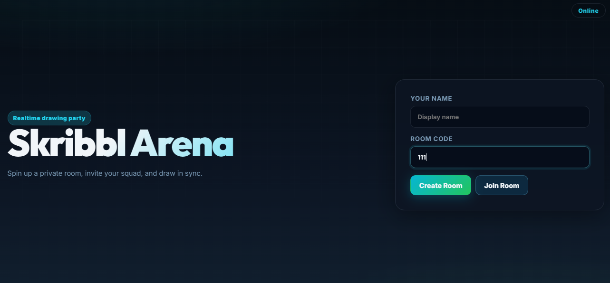
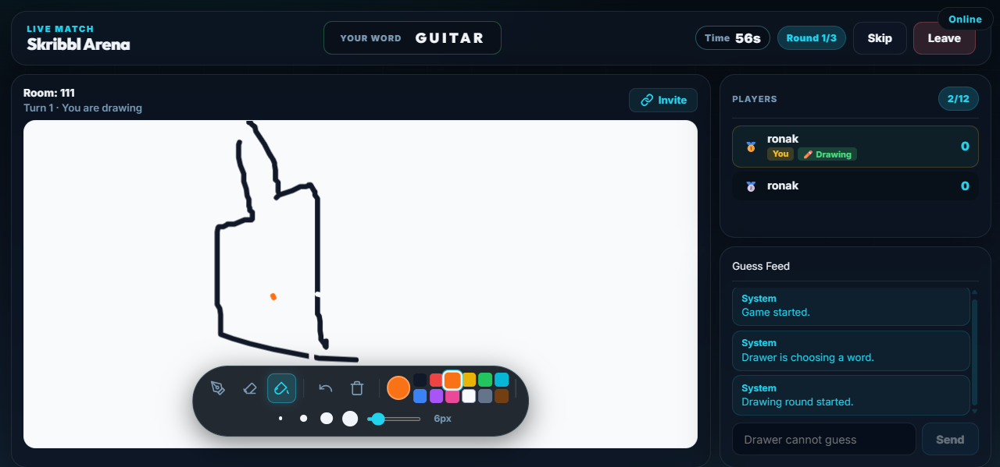

# 🎨 Scribble Clone — Realtime Multiplayer Drawing Game

A modern realtime multiplayer drawing and guessing game inspired by Skribbl.io, built with scalable full-stack architecture using React, TypeScript, Node.js, Express, and Socket.IO.

Players can:
- Create or join multiplayer rooms
- Draw in realtime on a synchronized canvas
- Guess words live through chat
- Compete with scoring and rounds
- Experience smooth multiplayer gameplay with modern UI/UX

---

# 🚀 Live Demo

## Frontend
https://scribble-clone-alpha.vercel.app

## Backend API
https://scribble-clone-backend-s0k6.onrender.com
---

# 📸 Preview



Suggested screenshots:


- 
- Drawing Canvas
- Chat & Guessing System
- Final Scoreboard

---

# ✨ Features

## 🔌 Realtime Multiplayer
- Socket.IO powered realtime communication
- Multiplayer room synchronization
- Live player updates
- Instant drawing synchronization

---

## 🏠 Multiplayer Room System
- Create / Join rooms
- Room isolation
- Host system
- Leave room support
- Automatic disconnect cleanup
- Auto room deletion
- Socket-to-room mapping

---

## 🎮 Lobby System
- Ready / Unready states
- Host-only controls
- Start game validation
- Multiplayer synchronization
- Realtime room state updates

---

## 🎨 Advanced Drawing Engine
- Shared realtime canvas
- Local-first rendering
- Brush tool
- Eraser tool
- Fill tool
- Undo support
- Color picker
- Brush size controls
- Canvas clearing
- Realtime multiplayer synchronization

---

## 🧠 Word & Turn System
- Secret word architecture
- Random word generation
- Turn rotation system
- Drawer-only permissions
- Word selection phase
- Automatic word selection timer

---

## 💬 Guessing & Chat System
- Live guessing system
- Correct guess detection
- Multiplayer chat
- Hidden word protection
- Guess tracking system

---

## 🏆 Scoring System
- Dynamic scoring
- Earlier correct guesses get higher points
- Drawer bonus points
- Live leaderboard updates

---

## ⏱️ Timer System
- Backend-authoritative timers
- Word selection countdown
- Round gameplay countdown
- Automatic turn progression

---

## 🎨 Modern UI/UX
- Fully responsive layout
- Single viewport gameplay design
- Glassmorphism UI
- Smooth animations
- Gradient backgrounds
- Modern multiplayer game aesthetics

---

# 🛠️ Tech Stack

## Frontend
- React
- TypeScript
- Vite
- Socket.IO Client
- Framer Motion
- CSS Grid / Flexbox

---

## Backend
- Node.js
- Express
- TypeScript
- Socket.IO

---

# 🧱 Project Architecture

## Frontend Architecture

```bash
client/src/
│
├── components/
├── screens/
├── canvas/
├── game/
├── socket/
├── hooks/
└── styles/
```

---

## Backend Architecture

```bash
server/src/
│
├── constants/
├── socket/
├── rooms/
├── game/
├── types/
└── utils/
```

---

# ⚙️ Multiplayer Architecture

The backend acts as the **single source of truth**.

## Backend Responsibilities
- Room state
- Game lifecycle
- Timers
- Scores
- Turn rotation
- Word generation
- Multiplayer synchronization
- Validation & anti-cheat logic

## Frontend Responsibilities
- UI rendering
- Emitting events
- Canvas rendering
- Visual animations

---

# 🔄 Gameplay Flow

```text
Player joins room
↓
Host starts game
↓
Drawer receives 3 random word choices
↓
6 second selection timer
↓
Word selected automatically if no choice
↓
80 second drawing round starts
↓
Players guess through chat
↓
Correct guessers receive points
↓
Round continues until timer ends
↓
Next turn begins automatically
```

---

# 🧠 Important Engineering Concepts Used

- Realtime multiplayer synchronization
- Event-driven architecture
- Backend-authoritative game state
- Local-first rendering
- Socket room isolation
- State machine architecture
- Multiplayer validation systems
- Canvas history architecture
- Stroke replay system
- Responsive viewport engineering

---

# 📦 Installation

## Clone Repository

```bash
git clone https://github.com/YOUR_USERNAME/scribble-clone.git
```

---

# 📁 Setup Frontend

```bash
cd client
npm install
npm run dev
```

Frontend runs on:
```bash
http://localhost:5173
```

---

# 📁 Setup Backend

```bash
cd server
npm install
npm run dev
```

Backend runs on:
```bash
http://localhost:3000
```

---

# 🔐 Environment Variables

## Frontend (.env)

```env
VITE_SERVER_URL=http://localhost:3000
```

---

## Backend (.env)

```env
CLIENT_URL=http://localhost:5173
PORT=3000
```

---

# 🌐 Deployment

## Frontend
Deployed using:
- Vercel

## Backend
Deployed using:
- Render

---

# 📈 Future Improvements

- Authentication system
- Matchmaking
- Friend system
- Voice chat
- Spectator mode
- Database persistence
- Mobile optimization
- AI word moderation
- Custom room settings
- Emoji reactions

---

# 🧪 Challenges Solved

## Realtime Synchronization
Implemented low-latency multiplayer drawing synchronization using Socket.IO.

## Canvas History Architecture
Used stroke-based replay system for:
- Undo
- Reconnect synchronization
- Multiplayer consistency

## Backend-Authoritative Timers
Prevented multiplayer desync by keeping timers controlled on backend.

## Secret Word System
Implemented private socket events so only drawer receives actual word.

---

# 📚 What I Learned

Through this project I learned:

- Full-stack realtime architecture
- Multiplayer game engineering
- Socket.IO event systems
- Scalable frontend architecture
- Backend state management
- Realtime canvas synchronization
- Turn-based game lifecycle design
- Responsive UI engineering
- Production deployment workflow

---

# 🤝 Contributing

Contributions, suggestions, and feedback are welcome.

Feel free to fork the repository and improve the project.

---

# 📄 License

This project is created for learning and portfolio purposes.

---

# 👨‍💻 Author

## Ankit Rawat

- GitHub: https://github.com/ankitRawat99

---

# ⭐ If You Like This Project

Give this repository a star ⭐
